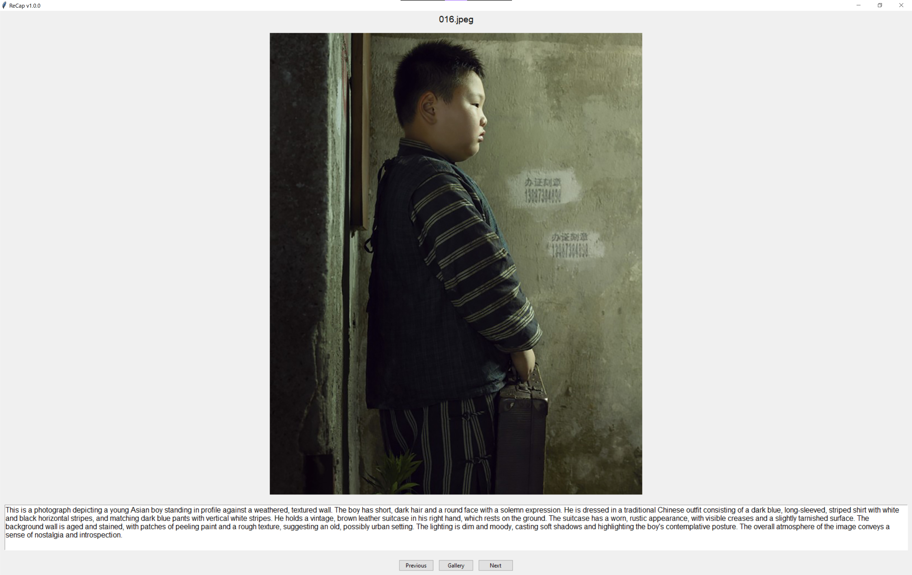

# ReCap
An image (re)captioning GUI for image generation models dataset preparation, made for easy caption editing.

This minimalistic UI aims at making dataset caption editing a little more efficient. It removes the need to open the captions in a separate text editor, struggle to preview the images, and navigate in the dataset, by bringing all these elements together. The caption editor can handle caption of arbitrary length, in any format.

## Installation
Assuming you have [Git](https://git-scm.com/), [Python](https://www.python.org/) and [Anaconda](https://www.anaconda.com/download) installed, follow these steps to install Dedup.
1. Clone the repository to the desired location on your machine: `git clone https://github.com/brayevalerien/recap` and move into the cloned directory using `cd recap`.
2. Create a new Conda environment and activate it: `conda create -n recap -y python=3.12 && conda activate recap`.
3. Install the project dependencies: `pip install -r requirements.txt`.

## Usage
Once you've followed the [installation instructions](#installation), start the app by running `python recap_gui.py`. It will open a window with a "Load dataset" button, click it and choose where your dataset is located. All subdirectories will be included for ease of use! Note that the captions for each image must be stored in a `txt` file with the same name as the image.

> [!WARNING]
> Loading large datasets might take a few minutes. I'm working on some optimization.

Once a dataset is loaded, you can start editing the caption. Use the "Next" and "Previous" buttons to navigate through the images in your dataset. Note that changing the image will save the edited caption automatically!

There also is a "Gallery" button, which will open a separate window with a gallery view of all your images for easy and quick navigation.